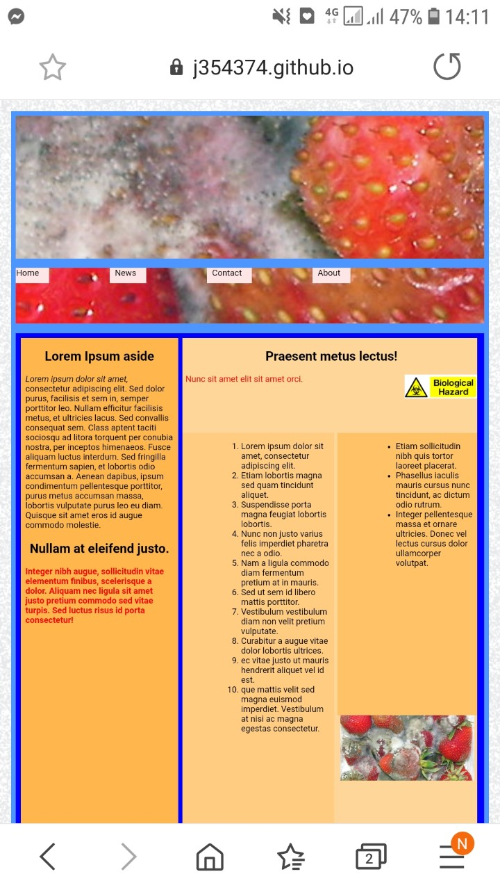
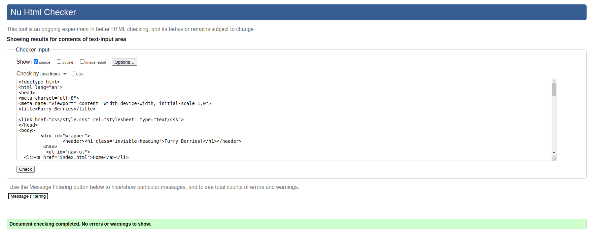
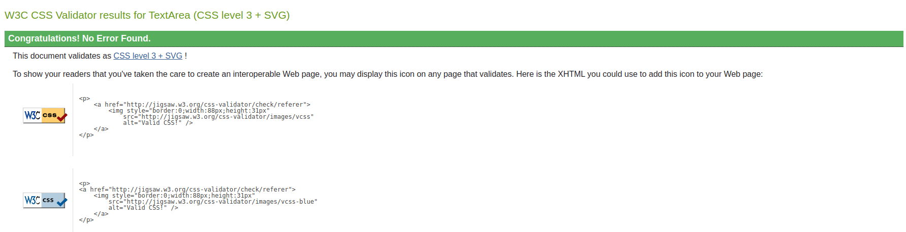

### readme
Student name: Christopher Caston

Student id: j354374

Front-End HTML Assignment 1 -attempt 2.

### checklist:

- [X] @mentions, #refs, [links](), **formatting**, and <del>tags</del> supported
- [X] DOCTYPE
- [X] html
- [X]  head
- [X] title
- [X] body
- [X] main  
- [X] h1
- [X] h2
- [X] h3
- [X] p
- [X] div
- [X] span
- [X] ul
- [X] li
- [X] img
- [X] header - height 200px
- [X] section
- [X] article
- [X] nav
- [X] aside
- [X] footer - height 150px
- [X] clear float class
- [X] outer - 1020px max


### Feedback from attempt 1
```
Hi

Good work

you need to fix your background image, you cannot have an image over 1 mb, you should aim for under 500kb for a full screen image, the fact that you distored the image means you used unnecessary bandwidth to download the image, which should have been adjusted in photoshop and then optimised to the smallest file size with no need to distort it on the page.  the rest of your images should be around 30 kb.

use should use padding to move your text away from the edge of the box.

you have unnecessary classes in your menu, target them directly with:

nav ul li {} the same in the header: header h1 {} no need for a class, you are bloating your code for no reason.

you also need a clearfloat

please fix and resubmit

thanks
```

### Checklist after feedback

- [X] smaller background image used
- [X] padding added
- [X] streamlined nav menu
- [X] header h1 class used instead of custom class and html bloat reduced.
- [X] clearfloat added as .clearfix and called using :after so that it will apply to the footer


### Reponsive website

In order to prepare and refine skills needed for the next assignment an effort to make the website responsive was attempted with the following:

* viewport device-width initial-scale set to 1.0
* @media in css adjust the wrapper and font size for different sized screens
* element widths were set to a percentage and heights to vh instead of px
* set font-size: 1vw; in html class
* img and font sizes set to percentages and height set to auto where possible.

## Screenshot from mobile device screen width 360px, height 640px



## HTML 5 validation attempt 2:


## CSS validation attempt 2:



### Image sources:

"furry-berries" by
Casey Bisson.

https://www.flickr.com/photos/maisonbisson/514809431/in/photostream/


"Biological hazard" by
George Hodan.

https://www.publicdomainpictures.net/en/view-image.php?image=55611&picture=biohazard-sign

Background was created using the "Hurl" filter in GIMP.
