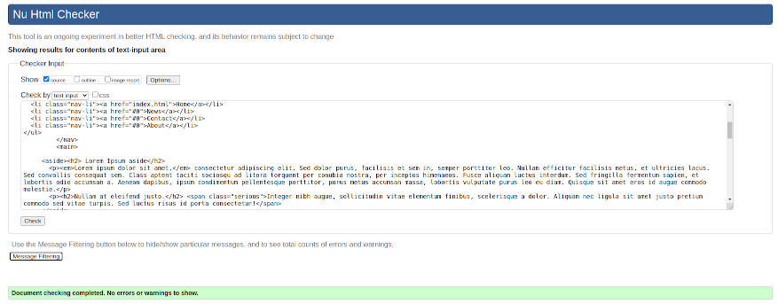
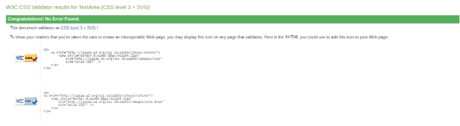

### readme
Student name: Christopher Caston

Student id: j354374

Front-End HTML Assignment 1.

### checklist:

- [X] @mentions, #refs, [links](), **formatting**, and <del>tags</del> supported
- [X] DOCTYPE
- [X] html
- [X]  head
- [X] title
- [X] body
- [X] main  
- [X] h1
- [X] h2
- [X] h3
- [X] p
- [X] div
- [X] span
- [X] ul
- [X] li
- [X] img
- [X] header - height 200px 
- [X] section
- [X] article
- [X] nav
- [X] aside
- [X] footer - height 150px
- [X] clear float class
- [X] outer - 1020px max

### HTML Initial Layout:


```
<!doctype html>
<html lang="en">
<head>
<meta charset="utf-8">
<title>Untitled Document</title>
<link href="css/style.css" rel="stylesheet" type="text/css">
</head>

<body>
	<div id="wrapper">
<header><h1>this is the heading</h1>
</header>
<nav>
 <p>This is the menu.</p>	
</nav>
<main>
<p>This is the content.</p>	
</main>
<footer>
<p>this is the footer</p>	
</footer>	
	

		
</div> 
</body>
</html>

```

## HTML 5 validation:


## CSS validation:



### Image sources:

"furry-berries" by
Casey Bisson.

https://www.flickr.com/photos/maisonbisson/514809431/in/photostream/


"Biological hazard" by
George Hodan.

https://www.publicdomainpictures.net/en/view-image.php?image=55611&picture=biohazard-sign

Background was created by taking a digital photo of a pin-up board and modifying it with photoshop and gimp.

Feedback from first attempt:

```
Good work

you need to fix your background image, you cannot have an image over 1 mb,
you should aim for under 500kb for a full screen image, the fact that you 
distored the image means you used unnecessary bandwidth to download the image,
which should have been adjusted in photoshop and then optimised to the smallest
file size with no need to distort it on the page.  the rest of your images should be around 30 kb.

use should use padding to move your text away from the edge of the box.

you have unnecessary classes in your menu, target them directly with:

nav ul li {} the same in the header: header h1 {} no need for a class, you are bloating your code for no reason.

you also need a clearfloat 

please fix and resubmit

thanks
```
